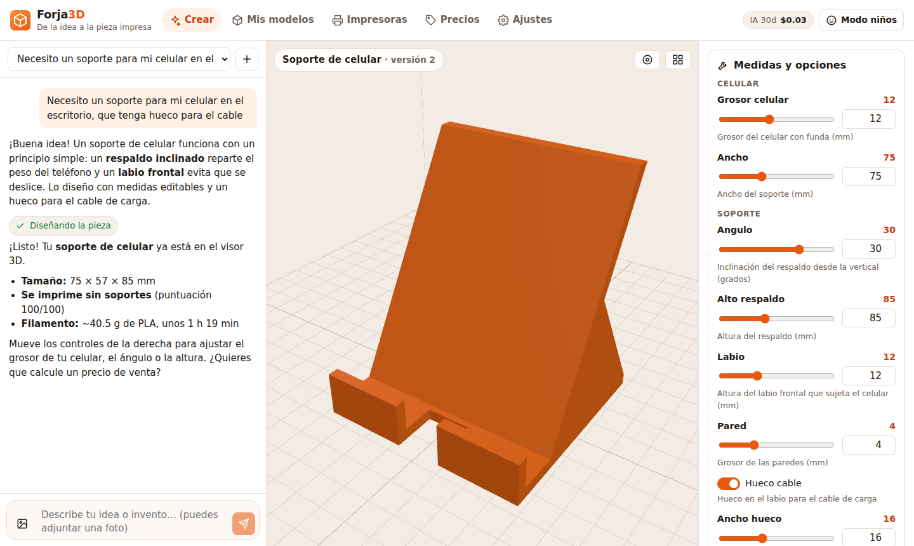
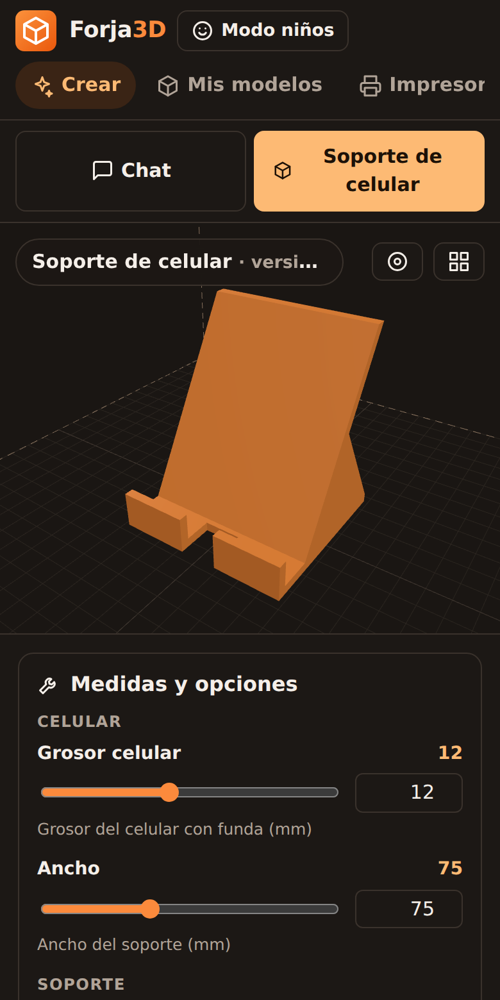

<div align="center">

# 🔥 Forja3D

**Tu agente de IA para imprimir en 3D: de la idea, o la foto de un invento, a la pieza impresa.**
Abierto, justo y hecho para todos: niños, escuelas, makers y emprendedores.

[Empezar](#-empezar-en-5-minutos) · [Cuánto cuesta](#-cuánto-cuesta-de-verdad) · [Impresoras](docs/IMPRESORAS.md) · [MCP](docs/MCP.md) · [Modelo justo](docs/MODELO-JUSTO.md) · [Hoja de ruta](docs/ROADMAP.md)



</div>

## ¿Por qué existe?

Ves un invento genial y quieres fabricarlo, mejorarlo o venderlo, pero:

- no encuentras el archivo, o el que encuentras no tiene las medidas que necesitas;
- no sabes CAD, y aunque lo supieras no sabes **cómo funciona** el mecanismo;
- las herramientas de IA 3D cobran suscripciones mensuales y créditos que se acaban.

Forja3D es un **agente especializado en impresión 3D** que conversa contigo, entiende la
función universal del objeto (palanca, resorte, encaje, bisagra…), lo **diseña con medidas
editables**, revisa que se pueda imprimir, calcula cuánto cuesta y lo envía a tu impresora.
Todo con código abierto. Solo pagas el costo real de la IA, o nada si usas un modelo en tu computadora.

## ✨ Qué hace

| | |
|---|---|
| 🧠 **Agente conversacional** | Explica cómo funciona un invento (también desde una foto), busca si ya existe, propone mejoras y lo diseña. Habla español e inglés. |
| 📐 **CAD paramétrico real** | El agente escribe OpenSCAD y Forja lo compila con el motor **Manifold** (WebAssembly, en menos de un segundo). Cada medida importante se vuelve un **control deslizante**. |
| ✅ **¿Se puede imprimir?** | Comprueba que la malla sea cerrada, detecta voladizos que necesitan soportes, revisa la base de apoyo y si cabe en tu impresora. El agente corrige el diseño solo. |
| 💰 **Precio justo** | Gramos, tiempo y costo real: material, luz, desgaste, trabajo y fallos. Sugiere precios de venta con comisiones e impuestos. |
| 🗿 **Figuras con IA (tipo Meshy)** | Figuras orgánicas desde una foto o un texto con modelos abiertos (TRELLIS, Hunyuan3D) **a precio de costo** (~$0.02) o gratis en tu GPU. |
| 🖨️ **Tus impresoras** | Bambu Lab (LAN), Prusa (PrusaLink), Klipper (Moonraker) y OctoPrint: estado, temperaturas, enviar, pausar y cancelar. |
| 📷 **Cámara con IA** | Detecta "espagueti", piezas despegadas y grumos, y **pausa la impresión** si el fallo se confirma. Con Claude, un modelo local o Obico (gratis). |
| 🔌 **Se conecta con todo** | Servidor **MCP**: úsalo desde Claude Desktop, Claude Code, ChatGPT, Cursor o VS Code con tu suscripción actual. API REST abierta. |
| 🧒 **Modo niños** | Lenguaje sencillo, pasos cortos, piezas seguras y recordatorios de seguridad. |
| 🔍 **Transparencia** | Cada respuesta muestra lo que costó. Límite de gasto mensual configurable. |

<p align="center"></p>

## 💸 Cuánto cuesta (de verdad)

| Acción | Meshy (plan Pro, $20/mes) | Forja3D |
|---|---|---|
| Suscripción | $20 – $100 al mes | **$0** (código abierto) |
| Figura desde imagen | 20 créditos ≈ **$0.40** | TRELLIS ≈ **$0.02**, Hunyuan3D 2 ≈ $0.16, en tu GPU **$0** |
| Diseñar una pieza funcional con medidas | No es su enfoque (mallas orgánicas) | Claude Opus 5 ≈ $0.10–0.50 por diseño (según complejidad) · Sonnet 5 ≈ 40 % de eso · Haiku ≈ 20 % · **modelo local $0** |
| Análisis de imprimibilidad | Gratis | **Gratis** (en tu equipo) |
| Revisar la cámara | — | ≈ $0.003 por foto con Haiku · **$0** con Obico o un modelo local |

Precios públicos consultados en septiembre de 2026 ([Meshy](https://www.meshy.ai/pricing), [créditos de Meshy](https://www.meshy.ai/tutorials/meshy-credits-guide),
[TRELLIS en fal](https://fal.ai/models/fal-ai/trellis/api), [Hunyuan3D en fal](https://fal.ai/models/fal-ai/hunyuan3d/v2),
[comparativa de APIs 3D](https://www.3daistudio.com/blog/best-3d-model-generation-apis-2026)). Pueden cambiar. El costo de Claude
depende de la conversación; Forja muestra el valor real de cada respuesta. Más detalles en [docs/MODELO-JUSTO.md](docs/MODELO-JUSTO.md).

## 🚀 Empezar en 5 minutos

### Opción A: con Node.js (Windows, Mac o Linux)

1. Instala [Node.js 22](https://nodejs.org) (o más nuevo).
2. En una terminal:

```bash
git clone https://github.com/DevStoreX/forja3d.git
cd forja3d
npm install
npm run build
npm start
```

3. Abre **http://localhost:8787** y elige cómo usar la IA (Claude, gratis con Ollama o desde tu asistente por MCP).

### Opción B: con Docker

```bash
cp .env.example .env        # opcional: pon tu ANTHROPIC_API_KEY
docker compose up -d        # → http://localhost:8787
docker compose --profile local-ai up -d   # además: Ollama para IA gratis y local
```

### Opción C: solo como herramienta MCP

Si ya pagas Claude, ChatGPT o Cursor, conecta Forja como servidor MCP y tu asistente diseñará
e imprimirá con las herramientas de Forja, **sin pagar nada más**. Instrucciones en [docs/MCP.md](docs/MCP.md).

### Para desarrollar

```bash
npm run dev      # API en :8787 y la interfaz con recarga en vivo en http://localhost:5173
npm test         # pruebas (geometría, OpenSCAD, conectores, agente, servidor, MCP)
npm run typecheck
```

## 🤖 Elige tu IA

| Opción | Calidad | Costo | Cómo |
|---|---|---|---|
| **Claude Opus 5** (por defecto) | La mejor para diseñar piezas complejas | Pago por uso | Clave en [console.anthropic.com](https://console.anthropic.com/settings/keys) |
| **Claude Sonnet 5 / Haiku 4.5** | Muy buena / buena | 40 % / 20 % del anterior | Un clic en *Ajustes → Calidad y costo* |
| **Ollama** (Qwen3, Llama, Gemma…) | Depende de tu equipo | **$0** | [ollama.com](https://ollama.com) → `ollama pull qwen3:8b` |
| **Compatible OpenAI** | Variable | Variable | LM Studio, OpenRouter, DeepSeek, Groq… |
| **Tu asistente vía MCP** | La de tu asistente | Tu suscripción actual | [docs/MCP.md](docs/MCP.md) |

Con Claude, Forja usa pensamiento adaptativo, caché de prompts (reduce hasta 90 % el costo del
contexto repetido), búsqueda web opcional y reserva automática del servidor ante rechazos.
Con modelos locales que no llaman herramientas, Forja compila automáticamente los bloques
de código OpenSCAD que escriben y les devuelve los errores para que los corrijan.

## 🖨️ Impresoras compatibles

| Marca / sistema | Conector | Estado y control | Enviar trabajos | Cámara |
|---|---|---|---|---|
| Bambu Lab A1, A1 mini, P1P/P1S/P2S, X1C, H2D | MQTT + FTPS (modo LAN) | ✅ | ✅ `.3mf` / `.gcode` | ✅ A1/P1 directo · X1/H2D con ffmpeg |
| Prusa MK4/MK4S, CORE One, MINI, XL | PrusaLink | ✅ | ✅ | URL de cámara |
| Klipper (Creality K1/K2, Voron, Elegoo Neptune 4…) | Moonraker | ✅ | ✅ | ✅ webcams de Moonraker |
| Ender, Anycubic y otras con OctoPrint | OctoPrint | ✅ | ✅ | ✅ |
| Simulada | — | ✅ | ✅ | — |

Guía paso a paso: [docs/IMPRESORAS.md](docs/IMPRESORAS.md). Forja envía archivos **laminados**
(G-code/3MF). Lamina en Bambu Studio, OrcaSlicer, PrusaSlicer o Cura y súbelo en el modelo, o
configura un laminador por línea de comandos para que Forja lamine solo.

## 🧱 Cómo está hecho

```
forja3d/
├── packages/core     Geometría (STL/GLB/OBJ), OpenSCAD WASM, análisis, estimación, precios,
│                     conectores de impresoras, cámara, búsqueda, mallas IA, almacenamiento
├── packages/agent    Proveedores de IA (Claude SDK, compatibles), 15 herramientas, bucle del agente
├── apps/server       API REST + chat en streaming + MCP por HTTP (Hono)
├── apps/mcp          Servidor MCP por stdio (Claude Desktop, Claude Code…)
├── apps/web          Interfaz (React + three.js), español/inglés, móvil, modo oscuro
└── examples          Diseños OpenSCAD paramétricos de ejemplo
```

Todo en TypeScript, sin base de datos que instalar (archivos JSON en `~/.forja3d`). Detalles en
[docs/ARQUITECTURA.md](docs/ARQUITECTURA.md).

## 🔒 Seguridad y privacidad

- **Local primero:** por defecto el servidor solo escucha en tu equipo (`127.0.0.1`). Tus diseños,
  claves e impresoras se quedan en tu disco.
- Si lo abres a tu red, define `FORJA_TOKEN`: la API, el MCP y la cámara piden token.
- Las claves nunca se devuelven completas al navegador.
- El código OpenSCAD generado por la IA corre aislado en WebAssembly, en hilos con límite de tiempo.
- El agente no diseña armas ni piezas de armas, pide confirmación antes de iniciar o cancelar
  impresiones y avisa cuando una acción cuesta dinero.

## 🤝 Contribuir

¡Toda ayuda suma! Diseños de ejemplo, traducciones, conectores para más impresoras, pruebas con
hardware real. Lee [CONTRIBUTING.md](CONTRIBUTING.md): trabajamos con ramas (`main` estable,
`develop` integración, `feature/*` para cambios).

## 📄 Licencia

[MIT](LICENSE). OpenSCAD (GPL-2.0) se usa como programa independiente compilado a WebAssembly.
Consulta [LICENSE](LICENSE) para los componentes de terceros.

---

<sub>Built for makers everywhere · Forja3D is an open-source AI agent for 3D printing: parametric CAD from chat or photos, printability checks, fair pricing, printer control (Bambu, Prusa, Klipper, OctoPrint), AI failure detection and an MCP server. English UI included.</sub>
